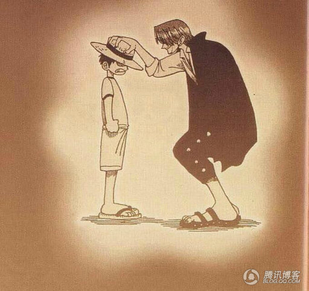

致谢
====================================
+ 感谢[freud提供的LessOrMore](http://www.hifreud.com/LessOrMore/)提供此博客的模板
+ 感谢[Less官网](http://lesscss.cn/)的样式，本Jekyll框架的样式都是基于Less官网的样式直接拷贝过来的。只是重构了JS，并且加入了Jekyll语法而已。
+ 感谢[Github](https://github.com/)提供的代码维护和发布平台
+ 感谢[Jekyll](https://jekyllrb.com/)团队做出如此优秀的产品

年轻的时候，不必慌忙去做选择，或者即使做了选择，也不必给自己加压；这是一辈子的事。
一辈子是一部电视剧，起承转合，更换场景，都太自然不过。  --作者：艾小羊

人生多短啊，从出生到死，只有900个月啊，难过一分钟都是巨大的浪费。
想明白自己要什么和不要什么，你之所以不开心，是因为你贪心。 --作者：咪蒙

作为前端小白，要更加努力！！

#### [博客链接 https://lanluohaisi.github.io/](https://lanluohaisi.github.io/)

